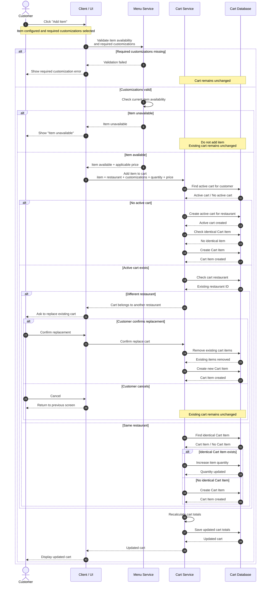

# FoodLand is a food delivery platform inspired by Talabat that connects customers with local restaurants through an integrated suite of core subsystems.

The high-level food-delivery application can be divided into:


```text
Customer
   ↓
Authentication / Authorization
   ↓
Restaurant & Menu
   ↓
Cart Management
   ↓
Order Management
   ↓
Payment Management
   ↓
Delivery
```


### Subsystems

| Subsystem | Responsibility |
|---|---|
| Authentication / Authorization | Authenticate customer and control access |
| Restaurant & Menu | Browse restaurants, menus, items, options, availability |
| **Cart Management** | Manage selected items before order creation |
| Order Management | Convert a valid cart into an order and manage order lifecycle |
| Payment Management | Process payment |
| Delivery | Manage delivery and driver operations |


---


# Talabat Cart Management System

> **Reverse Engineering & Requirements Analysis**
>
> This document analyzes the Cart Management domain of a real-world food-delivery application. The analysis is based on observed UI behavior, user flows, domain conventions, and common food-delivery system design principles.

---

# ER-Diagram Scratch


----

# Cart Management Subsystem ER-Diagram 


---

# UI / UX Screen Decomposition


The observed Cart flow can be represented as:

```text
Restaurant Menu Screen
        ↓
Select Menu Item
        ↓
Menu Item Customization Screen
        ↓
Select required/optional choices
        ↓
Define quantity
        ↓
Add Item
        ↓
Cart Screen


```

## Cart Screen

Purpose:

> Allow the customer to review and manage selected items before checkout.

Observed capabilities:

- Restaurant identity.
- Cart item details.
- Customizations.
- Quantity selector.
- Edit item.
- Delete item.
- Cart note.
- Payment summary.
- Promo code.
- Add more items.
- Checkout.


---

## 1. Problem Statement

A food-delivery shopping cart is not merely a list of selected menu items. It is a **dynamic state-management component** that bridges customer intent, menu/item availability, pricing, promotions, restaurant constraints, and the eventual order.

### Main Problem

Customers need a place to **collect, review, customize, update, and remove selected menu items** before placing an order, without repeatedly returning to the restaurant menu to manage each item.

The Cart Management System therefore allows customers to:

- Add selected and customized menu items to an active cart.
- View their selected items and customer choices.
- Update item quantity and customization.
- Delete cart items.
- View a payment summary.
- Apply promotional codes.
- Continue to checkout.

### Domain Problems

#### 1. Multi-Restaurant Cart Conflicts

Food-delivery orders are generally constrained to a single restaurant/merchant per checkout because restaurant preparation and delivery operations are tied to a particular merchant.

The cart must therefore handle the situation where a customer tries to add an item from another restaurant while an active cart already exists.

#### 2. Menu Dynamics & Item Availability

Menu items, options, availability, and prices can change after a customer has opened a menu or added an item to a cart.

The system must therefore handle:

- Items becoming unavailable.
- Restaurant status changing.
- Price changes.
- Menu/customization changes.
- Final validation before order placement.

#### 3. Complex Item Customization

A menu item may contain required and optional customization groups, such as:

- Size
- Protein
- Toppings
- Add-ons
- Drinks
- Special instructions

The cart must preserve the customer's selected configuration.

Two instances of the same base menu item are not necessarily the same Cart Item if their configurations differ.

#### 4. Real-Time Cart Calculation

The cart total can depend on multiple values:

```text
Item prices
+ Customization/add-on prices
- Discounts
+ Delivery fee
+ Service fee
+ Other applicable charges
= Total
```

The system must recalculate applicable values when cart contents change.

#### 5. Promotion Constraints

Promotions may depend on conditions such as:

- Minimum subtotal.
- Eligible restaurant.
- Eligible menu items.
- Validity period.
- Customer eligibility.
- Maximum discount.

Changing cart contents may cause a promotion to become applicable or invalid.

#### 6. Cart Persistence & Abandonment

Customers may leave a cart without placing an order.

The system needs a cart lifecycle that can handle:

- Application backgrounding.
- Network interruption.
- Returning to an existing cart.
- Stale cart data.
- Expired promotions.
- Changed item availability.
- Price changes.


---

## 2 Scope

### In Scope

| Capability | Description |
|---|---|
| View cart item | Display selected item, choices, quantity, and price |
| Add item | Add a selected/customized menu item to the active cart |
| Update cart item | Change quantity, customization, and item note |
| Delete cart item | Remove a selected cart item |
| Payment summary | Display subtotal, discount, service fee, delivery fee, and total |
| Apply promo code | Apply an eligible promotional code |
| Restaurant constraint | Handle attempts to add items from another restaurant |
| Item availability validation | Validate item availability during cart operations |
| Price handling | Capture an item price snapshot and revalidate pricing before order placement |
| Cart persistence | Persist the cart beyond a temporary UI session |
| Cart lifecycle | Handle active, abandoned, expired, or converted carts |

### Out of Scope

| Capability | Reason |
|---|---|
| Payment processing | Owned by the Payment subsystem |
| Restaurant inventory quantity management | Owned by restaurant/menu/inventory capabilities |
| Delivery/driver management | Owned by the Delivery subsystem |
| Restaurant menu management | Owned by the Restaurant/Menu subsystem |
| Order fulfillment/tracking | Owned by Order/Delivery capabilities |

---


### 3 Cart Boundary

```text
Restaurant/Menu
      │
      │ item + choices + availability + price
      ▼
┌───────────────────────┐
│   CART MANAGEMENT     │
│                       │
│ Cart                  │
│ Cart Items            │
│ Customizations        │
│ Notes                 │
│ Promotions            │
│ Totals                │
└───────────────────────┘
      │
      │ validated cart
      ▼
Order Management
      │
      ▼
Payment
      │
      ▼
Delivery
```

---


# 4 Actors & Roles

## Primary Actor

### Customer

The customer directly interacts with the Cart Management System to:

- Add items.
- View items.
- Update items.
- Delete items.
- Apply promotions.
- Review totals.
- Proceed to checkout.

## Secondary Actors

### Restaurant/Menu/Availability System

May provide or validate:

- Menu item.
- Item availability.
- Restaurant status.
- Current item information.
- Current applicable price.

---

# 5 Feature Priorities

##  MVP

The MVP should provide the minimum capability required for a customer to prepare and review an order.

| Feature | Priority | Reason |
|---|---|---|
| Add item | MVP | Core purpose of the cart |
| View cart | MVP | Customer must review selected items |
| Update quantity | MVP | Customer must modify order quantity |
| Edit customizations | MVP | Customer must manage item choices |
| Delete item | MVP | Customer must remove unwanted items |
| View payment summary | MVP | Customer needs to understand payable amount |
| Apply promo code | Post-MVP / business-dependent | Directly affects final payable amount |
| Checkout transition | MVP | Cart must lead to order creation |


---


# 6 Use Case Inventory

The following use cases represent the current Cart Management scope.

| ID | Use Case | Status |
|---|---|---|
| UC-1 | Add Item to Cart | **Done - Hajar** |
| UC-2 | Update Cart Item | **Done — Abdalla** |
| UC-3 | Delete Cart Item | Not-Yet |
| UC-4 | View Cart | Not-Yet |
| UC-5 | Apply Promo Code | Later |
| UC-6 | View Payment Summary | Not-Yet |
| UC-7 | Add More Items from Same Restaurant | Later |
| UC-8 | Proceed to Checkout | Later |

---

## UC-2 Update Cart Item — Documentation Map

| Document | Purpose |
|---|---|
| [Use Case](design/cartModule/modify/UC-2-Update-Cart-Item.md) | Preconditions, main/alternative flows, business rules, and exceptions |
| [API Design](design/cartModule/modify/Update-Cart-Item-API.md) | PATCH contract, request/response examples, validation codes, and database notes |
| [Flowchart](design/cartModule/modify/Update-Cart-Item-Flowchart.md) | Decision flow for updates, deletion, inventory, and customizations |
| [Sequence Diagram](design/cartModule/modify/Update-Cart-Item-Sequence.md) | Controller, service, repository, mapper, and database interactions |

### Implementation Map

```text
PATCH /api/v1/carts/{cartId}/items/{cartItemId}
  → CartController
  → UpdateCartService / CartServiceImpl
  → CartItemRepository and customization repositories
  → PostgreSQL foodland schema
  → shared CartMapper
  → CartResponse
```

The update operation supports partial quantity, note, and customization changes. Cart-item quantity `0` deletes the entire item. Customization quantity `0` removes that option, while an empty customization list removes all selections only when every linked group is optional. Business failures are returned through `ErrorMapping` and `GlobalExceptionHandler`.

---

#  Detailed Use Case — UC-1: Add Item to Cart


## Basic Information

| Field | Definition |
|---|---|
| **Use Case** | UC-1 — Add Item to Cart |
| **Primary Actor** | Customer |
| **Secondary Actor** | Restaurant/Menu/Availability System |
| **Goal** | Allow the customer to add a selected and customized menu item to the active cart |
| **Trigger** | Customer clicks **Add Item** after configuring the menu item |

## Preconditions

1. Required item customizations have been selected.
2. Menu item is currently available.
3. Restaurant is open/accepting orders.


## Main Flow

1. Customer clicks **Add Item**.
2. System checks whether an active cart exists.
3. If no active cart exists, the system creates an active cart for the restaurant.
4. If an active cart exists, the system checks whether it belongs to the same restaurant.
5. If the active cart belongs to a different restaurant, follow **A1 — Different Restaurant**.
6. If the cart belongs to the same restaurant, the system checks whether an identical Cart Item already exists.
7. If no identical Cart Item exists:
   - System captures the applicable item price.
   - System creates a new Cart Item.
8. If an identical Cart Item exists, follow **A2 — Existing Identical Cart Item**.
9. System recalculates applicable cart totals.
10. System returns/displays the updated cart.


#  Alternate Flows

## A1 — Add Item from Different Restaurant / Replace Cart

**Condition:** An active cart exists and belongs to a different restaurant.

1. System detects that the active cart belongs to another restaurant.
2. System informs the customer that the existing cart contains items from another restaurant.
3. System asks whether the customer wants to replace the existing cart.
4. Customer confirms replacement.
5. System removes the existing cart items.
6. System adds the new restaurant's selected item.
7. System recalculates applicable cart totals.
8. System displays the updated cart.

### A1.1 — Customer Cancels

1. Customer selects **Cancel**.
2. System keeps the existing cart unchanged.
3. System does not add the new item.
4. System returns the customer to the previous screen.


## A2 — Existing Identical Cart Item

**Condition:** An identical configured Cart Item already exists.

1. System detects the identical Cart Item.
2. System increases the existing item's quantity.
3. System recalculates applicable cart totals.
4. System displays the updated cart.

# Exception Flows

## E1 — Menu Item Becomes Unavailable

A menu item can become unavailable after the customer opened the customization screen.

1. Customer submits **Add Item**.
2. System validates current item availability.
3. System detects that the item is no longer available.
4. System informs the customer.
5. System does not add the item to the cart.
6. Existing cart remains unchanged.

### UI-Level Validation

If the UI already knows the item is unavailable:

```gherkin
Given the menu item is unavailable
When the customer views the item
Then the "Add Item" button is disabled
```

### Backend-Level Validation

The backend must not rely solely on the button state:

```gherkin
Given the menu item has become unavailable
When the customer submits an Add Item request
Then the system rejects the request and informs the customer that the item is unavailable
```


#  Validation — Required Customizations

Required customizations must be selected before an item can be added.

```gherkin
Given the customer has not selected all required options
When the customer views the customization screen
Then the customer cannot successfully add the item to the cart
```


---
# Sequence Diagram — UC-1 Add Item to Cart

---
# Flow Chart Diagram — UC-1 Add Item to Cart

```mermaid

%%{init: {
  "theme": "base",
  "themeVariables": {
    "background": "#0d1117",
    "primaryColor": "#161b22",
    "primaryTextColor": "#f0f6fc",
    "primaryBorderColor": "#30363d",
    "lineColor": "#8b949e",
    "secondaryColor": "#161b22",
    "tertiaryColor": "#161b22",
    "fontFamily": "Inter, -apple-system, BlinkMacSystemFont, Segoe UI, sans-serif",
    "fontSize": "14px"
  }
}}%%

flowchart TD

    START([START])

    START --> UI1["Customer configures<br/>menu item"]
    UI1 --> UI2["Customer clicks<br/>Add Item"]

    UI2 --> MENU1["Menu Service<br/>Validate required customizations"]

    MENU1 --> CUSTOM{"All required<br/>customizations selected?"}

    CUSTOM -->|No| ERROR1["Show validation error"]
    ERROR1 --> END1([END])

    CUSTOM -->|Yes| MENU2["Menu Service<br/>Check current item availability"]

    MENU2 --> AVAILABLE{"Menu item<br/>available?"}

    AVAILABLE -->|No| ERROR2["Show Item Unavailable"]
    ERROR2 --> END2([END])

    AVAILABLE -->|Yes| PRICE["Menu Service returns<br/>applicable item price"]

    PRICE --> CART1["Cart Service receives<br/>Add Item request"]

    CART1 --> CART2["Check active cart<br/>for customer"]

    CART2 --> EXISTS{"Active cart<br/>exists?"}

    EXISTS -->|No| CREATE_CART["Create active cart<br/>for selected restaurant"]
    CREATE_CART --> ITEM_CHECK

    EXISTS -->|Yes| RESTAURANT["Check active cart<br/>restaurant"]

    RESTAURANT --> SAME{"Same restaurant?"}

    SAME -->|No| DIFFERENT["Different restaurant<br/>Inform customer"]

    DIFFERENT --> REPLACE{"Replace existing<br/>cart?"}

    REPLACE -->|No| CANCEL["Cancel operation<br/>Keep existing cart unchanged"]
    CANCEL --> END3([END])

    REPLACE -->|Yes| CLEAR["Remove existing<br/>cart items"]

    CLEAR --> ADD_NEW["Add selected item<br/>from new restaurant"]

    ADD_NEW --> TOTALS

    SAME -->|Yes| ITEM_CHECK["Check for identical<br/>Cart Item"]

    ITEM_CHECK --> IDENTICAL{"Identical configured<br/>Cart Item exists?"}

    IDENTICAL -->|Yes| INCREASE["Increase existing<br/>Cart Item quantity"]

    IDENTICAL -->|No| CREATE_ITEM["Capture applicable price<br/>Create new Cart Item"]

    INCREASE --> TOTALS
    CREATE_ITEM --> TOTALS

    TOTALS["Cart Service<br/>Recalculate cart totals"]

    TOTALS --> SAVE["Save updated cart<br/>and cart items"]

    SAVE --> RESPONSE["Return updated cart"]

    RESPONSE --> UI3["Display updated cart<br/>to customer"]

    UI3 --> END4([END])


    %% Dark GitHub design

    classDef startEnd fill:#1f2937,stroke:#8b949e,color:#f0f6fc,stroke-width:2px

    classDef ui fill:#172554,stroke:#58a6ff,color:#dbeafe,stroke-width:2px

    classDef menu fill:#2d1f12,stroke:#f0883e,color:#ffdfc4,stroke-width:2px

    classDef cart fill:#251942,stroke:#bc8cff,color:#eadcff,stroke-width:2px

    classDef decision fill:#1c2128,stroke:#8b949e,color:#f0f6fc,stroke-width:2px

    classDef error fill:#3b1618,stroke:#f85149,color:#ffd7d5,stroke-width:2px

    classDef alternate fill:#332a00,stroke:#d29922,color:#ffe8a3,stroke-width:2px

    classDef success fill:#12261a,stroke:#3fb950,color:#aff5b7,stroke-width:2px


    class START,END1,END2,END3,END4 startEnd

    class UI1,UI2,UI3 ui

    class MENU1,MENU2,PRICE menu

    class CART1,CART2,CREATE_CART,RESTAURANT,CLEAR,ADD_NEW,ITEM_CHECK,INCREASE,CREATE_ITEM,TOTALS,SAVE,RESPONSE cart

    class CUSTOM,AVAILABLE,EXISTS,SAME,REPLACE,IDENTICAL decision

    class ERROR1,ERROR2,CANCEL error

    class DIFFERENT alternate
```


---


