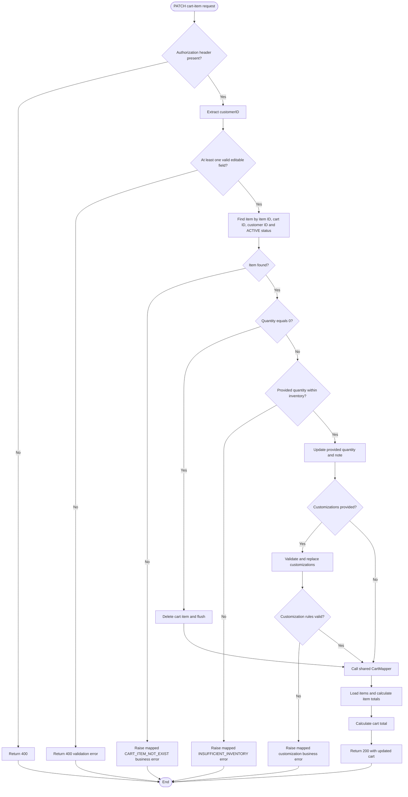

# Update Cart Item — Flowchart

## Flow Notes

- Quantity `0` deletes the item; it is never saved as a database quantity.
- Quantities `1–99` update the item after inventory validation.
- Omitted fields remain unchanged.
- Provided customizations replace previous selections after option and group validation.
- A customization with quantity `0` is removed instead of being stored.
- An empty list removes all customizations when all groups are optional; required groups still reject it.
- Business and validation failures are mapped to structured `400` responses by `GlobalExceptionHandler`.
- `CartMapper` is shared by the add-cart and update-cart response flows.
- The repository lookup enforces cart ownership and `ACTIVE` status.
- The returned cart excludes a deleted item and includes recalculated totals.
- The operation runs in one transaction.
