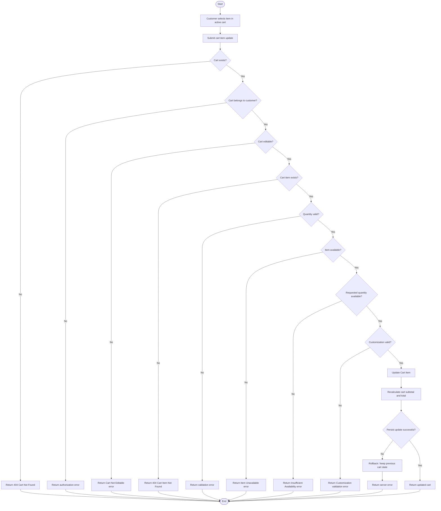

# Update Cart Item — Flowchart

## Flow Notes

- **Quantity = 0** is rejected here. The existing Remove Item use case should be used to remove an item.
- Availability is checked before persisting an increased quantity.
- The cart is recalculated only after validation succeeds.
- Persistence failure must not leave a partially updated cart.
