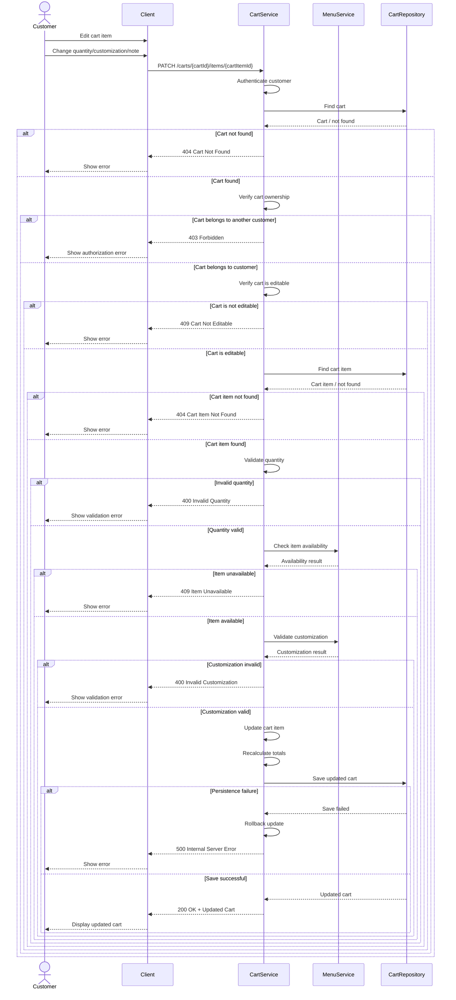

# Update Cart Item — Sequence Diagram

## Sequence Notes

1. The service verifies ownership before modifying any cart data.
2. Quantity validation happens before the update.
3. Availability is checked especially when the requested quantity increases.
4. Customization validation is performed when customization data is included.
5. Totals are recalculated after the item has been validated.
6. The persistence operation should be transactional so a failed save does not leave a partially modified cart.
