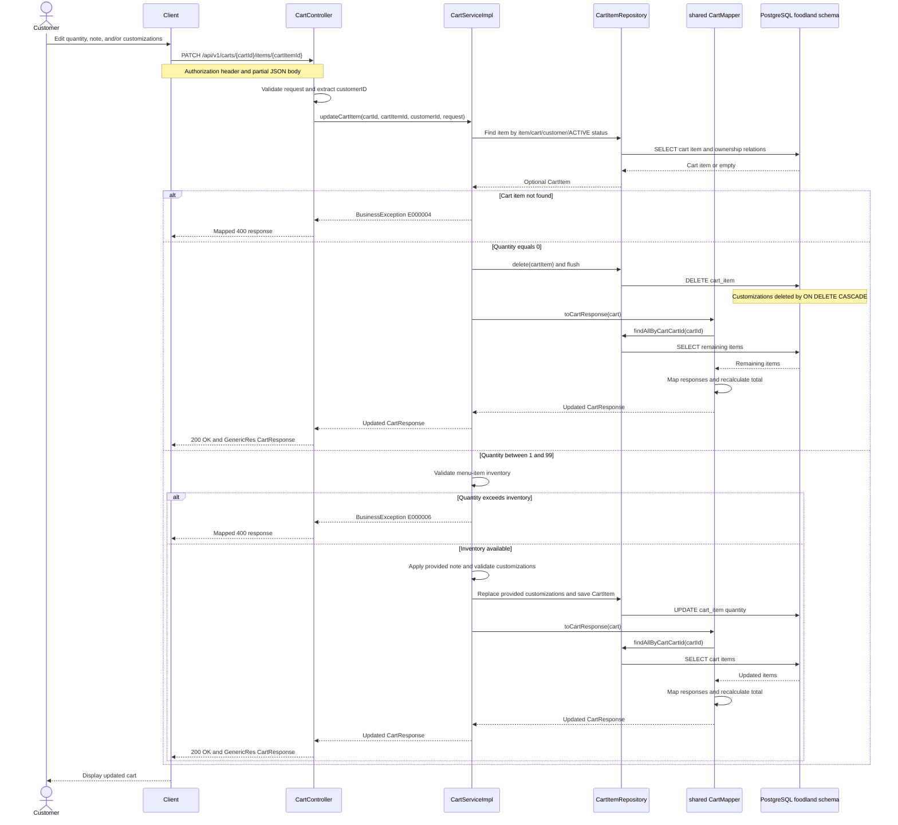

# Update Cart Item — Sequence Diagram

## Sequence Notes

1. Ownership is enforced by the repository lookup before modification.
2. Quantity `0` follows the delete branch before inventory validation.
3. Quantities `1–99` are checked against inventory before saving.
4. The shared mapper reloads remaining items and returns the entire updated cart.
5. The transaction rolls back if persistence fails.
6. Omitted request fields remain unchanged; provided customizations replace existing selections.
7. Customization quantity `0` removes that option before the replacement list is saved.
8. An empty customization list removes all selections only when all linked groups are optional.
9. `GlobalExceptionHandler` maps update business errors through `ErrorMapping`.
