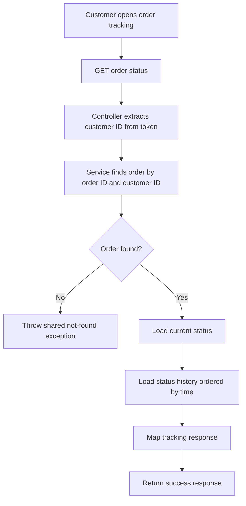
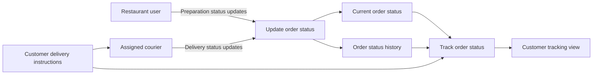
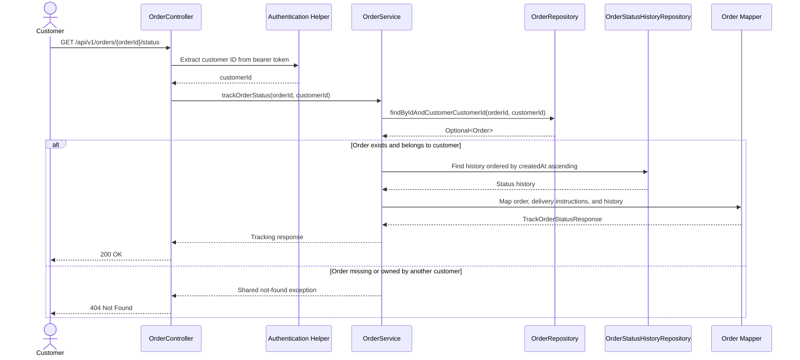

# Track Order Status Design

## ERD Reference

This use case uses the existing order, order status, and order status history relationships defined in the [FoodLane ERD](../../mermaid-diagram%20%283%29.png). The ERD is referenced without modification.

## Use Case

| Field | Description |
| --- | --- |
| Use case | Track order status |
| Primary actor | Authenticated customer |
| Supporting actors | Restaurant user and assigned courier |
| Goal | View the current status and status history of an order owned by the customer |
| Trigger | The customer opens the order-tracking page or requests the latest order status |
| Result | The API returns the current status and chronological tracking history |

## Preconditions

- The customer is authenticated.
- The authentication token contains the customer's identity.
- The requested order exists and belongs to the authenticated customer.
- A courier must be assigned before courier-only delivery transitions can be performed.

## Main Flow

1. The customer selects an order to track.
2. The client sends a `GET` request containing the order ID and bearer token.
3. The controller extracts the customer ID from the authentication token.
4. The service retrieves the order using both the order ID and customer ID.
5. The service reads the order's current status and status history.
6. The history is ordered from the earliest status change to the latest.
7. The mapper creates the tracking response.
8. The API returns the current status and tracking history.

## Alternative and Error Flows

### Order Does Not Exist or Does Not Belong to the Customer

Return the same not-found response in both cases. This prevents one customer from discovering whether another customer's order exists.

### Missing or Invalid Authentication

Return an authentication error according to the shared authentication and exception-mapping behavior.

### No Status History Exists

Return the order's current status and an empty history list. The API must not fail only because historical rows are unavailable.

## Business Rules

- A customer can track only their own orders.
- Tracking is read-only and must not change the order or its status.
- Restaurant users and couriers produce the status updates displayed to the customer.
- Restaurant users can perform restaurant preparation transitions.
- Only the courier assigned to the order can perform courier delivery transitions.
- The current status comes from the order's current status relationship.
- Status history is returned in ascending timestamp order.
- Each history entry should record the authenticated user who performed the update in `changedBy`, when available.
- Delivery instructions such as `Leave at the front door` are customer instructions, not order statuses.
- Delivery instructions are captured when the order is placed, saved as part of the order delivery snapshot, and shown to the assigned courier and customer.
- Only valid system statuses are returned:
  - `PENDING`
  - `ACCEPTED`
  - `PREPARING`
  - `READY_FOR_PICKUP`
  - `OUT_FOR_DELIVERY`
  - `DELIVERED`
  - `CANCELLED`
- The tracking endpoint does not validate status transitions because it does not update status.

## Status Update Responsibilities

| Actor | Allowed transition |
| --- | --- |
| Restaurant user | `PENDING` → `ACCEPTED` |
| Restaurant user | `PENDING` → `CANCELLED` |
| Restaurant user | `ACCEPTED` → `PREPARING` |
| Restaurant user | `ACCEPTED` → `CANCELLED` |
| Restaurant user | `PREPARING` → `READY_FOR_PICKUP` |
| Assigned courier | `READY_FOR_PICKUP` → `OUT_FOR_DELIVERY` |
| Assigned courier | `OUT_FOR_DELIVERY` → `DELIVERED` |

The update-status implementation must authenticate the caller and verify either restaurant ownership or courier assignment before accepting a transition.

## Delivery Instructions

The customer can provide optional instructions while placing the order. For example:

```json
{
  "deliveryAddressId": 1,
  "paymentMethod": "CARD",
  "deliveryInstructions": "Leave at the front door"
}
```

These instructions describe how the courier should complete the delivery. They do not affect the status-transition sequence. After following the instructions, the courier changes the status from `OUT_FOR_DELIVERY` to `DELIVERED`.

## API Design

### Customer Tracking Request

```http
GET /api/v1/orders/{orderId}/status
Authorization: Bearer <token>
```

The request has no body.

### Customer Tracking Success Response

```json
{
  "header": {
    "statusCode": "I000000",
    "statusDesc": "Success"
  },
  "body": {
    "orderId": 1002,
    "currentStatus": "OUT_FOR_DELIVERY",
    "deliveryInstructions": "Leave at the front door",
    "statusHistory": [
      {
        "status": "PENDING",
        "changedAt": "2026-08-28T12:00:00Z"
      },
      {
        "status": "ACCEPTED",
        "changedAt": "2026-08-28T12:03:00Z"
      },
      {
        "status": "PREPARING",
        "changedAt": "2026-08-28T12:10:00Z"
      },
      {
        "status": "OUT_FOR_DELIVERY",
        "changedAt": "2026-08-28T12:40:00Z"
      }
    ]
  }
}
```

The response should use the project's shared response wrapper and exception mapper.

### Restaurant and Courier Status Update Request

Restaurant users and assigned couriers use the existing status-update path. A separate driver endpoint is not required.

#### Temporary Development Authentication

Until authentication supplies the caller's user ID and role, the endpoint accepts temporary development-only headers:

```http
PATCH /api/v1/orders/{orderId}/status
Content-Type: application/json
X-User-Id: <seeded-user-id>
X-User-Role: <RESTAURANT-or-COURIER>
```

These headers must never be trusted in production because a client can provide any ID or role. The seeded database must contain the matching user, restaurant relationship or courier profile, and courier assignment used for testing.

Restaurant example:

```http
PATCH /api/v1/orders/1002/status
Content-Type: application/json
X-User-Id: 2
X-User-Role: RESTAURANT
```

```json
{
  "status": "PREPARING"
}
```

When the assigned courier collects the order:

```http
PATCH /api/v1/orders/1002/status
Content-Type: application/json
X-User-Id: 3
X-User-Role: COURIER
```

```json
{
  "status": "OUT_FOR_DELIVERY"
}
```

When the assigned courier completes the delivery, including a front-door delivery:

```json
{
  "status": "DELIVERED"
}
```

The endpoint must use the authenticated caller to enforce the following rules:

- A restaurant user may perform only the restaurant transitions listed above and must belong to the order's restaurant.
- A courier may perform only the courier transitions listed above and must match the courier assigned to the order.
- The service records the authenticated user's ID in `OrderStatusHistory.changedBy`.
- A caller without permission receives the shared authorization error response.

The delivery instruction is not sent again in the status update. It was saved when the order was placed and is displayed to the courier.

#### Authentication Integration

When authentication is complete, replace `X-User-Id` and `X-User-Role` with the authenticated user ID and role obtained from the bearer token:

```http
PATCH /api/v1/orders/{orderId}/status
Authorization: Bearer <restaurant-or-courier-token>
Content-Type: application/json
```

Only the controller's source of caller identity changes. The service authorization, transition validation, courier-assignment validation, restaurant-ownership validation, and history-recording rules remain the same.

## Suggested DTOs

### TrackOrderStatusResponse

| Field | Type | Description |
| --- | --- | --- |
| `orderId` | `Long` | Unique order identifier |
| `currentStatus` | `String` | Current order status code |
| `deliveryInstructions` | `String` | Optional instructions supplied by the customer |
| `statusHistory` | `List<OrderStatusHistoryResponse>` | Chronological status changes |

### OrderStatusHistoryResponse

| Field | Type | Description |
| --- | --- | --- |
| `status` | `String` | Status code recorded at this step |
| `changedAt` | `LocalDateTime` or `Instant` | Time at which the status was recorded |

## Repository Access

The order lookup should include the authenticated customer ID rather than retrieving an order by ID alone.

```java
Optional<Order> findByIdAndCustomerCustomerId(Long orderId, Long customerId);
```

The status-history repository should retrieve the order's history in chronological order. The exact derived-query name must match the entity field names.

```java
List<OrderStatusHistory> findByOrderOrderByCreatedAtAsc(Order order);
```

## Component Flow



## Status Update Sources



## Sequence Diagram



## Implementation Scope

The implementation will require:

1. A response DTO for the current status and status history.
2. A controller `GET` endpoint.
3. A service method that verifies customer ownership.
4. Repository access for the customer-scoped order and chronological history.
5. Mapper logic using the project's shared mapper conventions.
6. A delivery-instructions field in the place-order request and persisted order delivery snapshot.
7. Authorization rules that restrict restaurant and courier status transitions.
8. Temporary `X-User-Id` and `X-User-Role` headers while authentication integration is unavailable.
9. Seeded restaurant-user ownership and courier-assignment data for local testing.
10. Unit tests for success, missing order, unauthorized ownership, invalid temporary role, empty history, delivery instructions, and actor-specific transitions.
11. Removal of the temporary headers after bearer-token authentication provides the caller identity and role.
