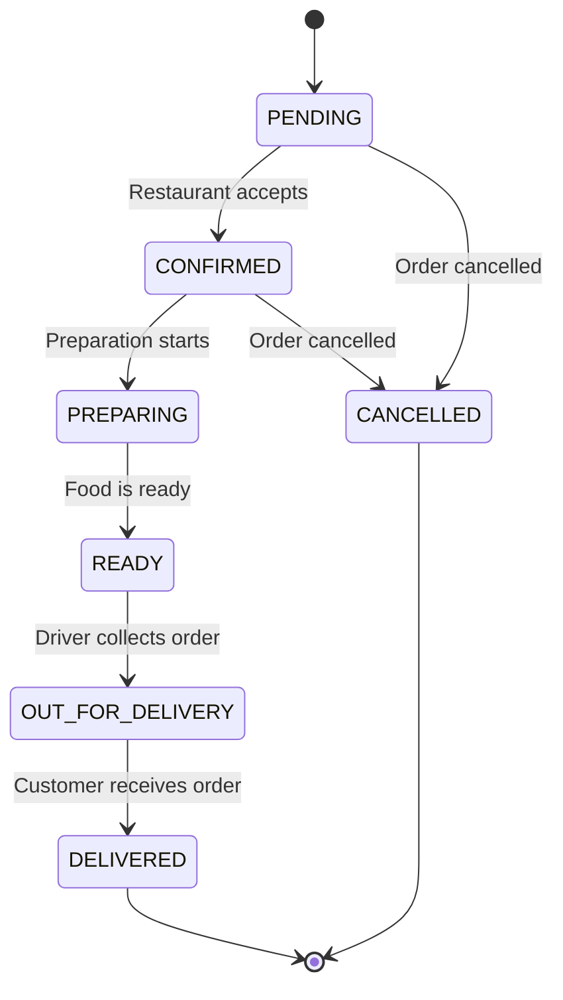
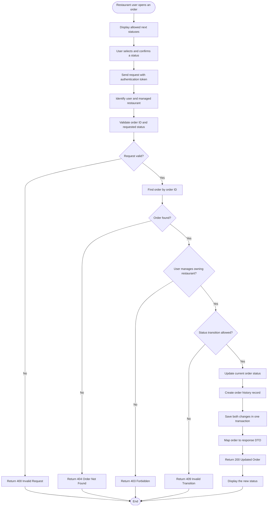
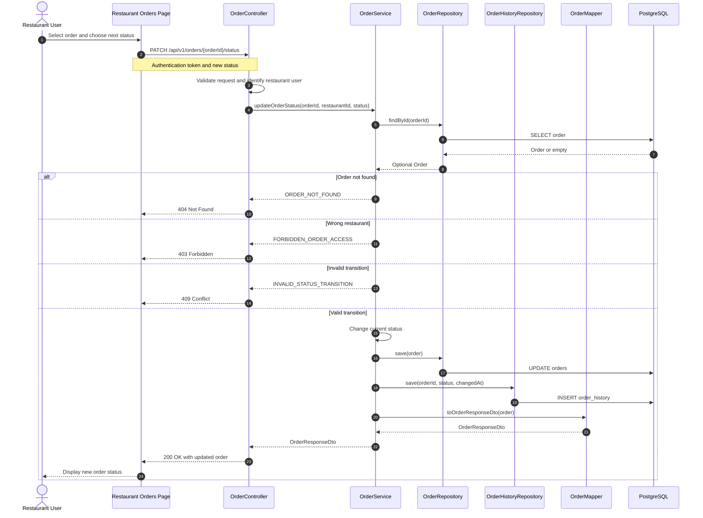

# Update Order Status — Design

This document contains the complete draft design for GitHub issue #18.

## ERD Reference

This use case follows the existing [Order Management ERD](../../mermaid-diagram%20%283%29.png).

No ERD update is currently required because the referenced design already contains:

- `orders.status` for the current status.
- `order_history.order_id`, `status`, and `changed_at` for status history.

The ERD should change only if implementation introduces another column or relationship, such as `changed_by`, a status-change reason, or an optimistic-locking `version`.

## Use Case

| Field | Description |
|---|---|
| Actor | Authenticated restaurant user |
| Goal | Move an order to its next valid status |
| Trigger | The user selects an allowed next status from the restaurant's Orders page |
| Result | The current order status and its history are updated together |

### Restaurant User Interaction

1. The restaurant user logs in and opens the restaurant dashboard.
2. The user opens the **Orders** page and selects an order.
3. The interface displays only the next statuses allowed for the order's current status.
4. The user selects the new status and confirms the update.
5. The frontend sends the order ID, new status, and authentication token to the API.
6. The API verifies that the authenticated user is allowed to manage the order's restaurant.
7. After a successful response, the interface displays the new status.

### Preconditions

- The caller is an authenticated restaurant user.
- The authenticated user is authorized to manage the restaurant that owns the order.
- The order exists.
- The requested status is a valid `OrderStatus` value.

### Main Flow

1. The restaurant user selects an allowed next status from the Orders page.
2. The frontend sends the order ID and requested status with the user's authentication token.
3. The controller validates the request and obtains the authenticated user's restaurant ID.
4. The service loads the order.
5. The service verifies that the order belongs to a restaurant managed by the user.
6. The service verifies that the transition from the current status is allowed.
7. The service updates `orders.status`.
8. The service inserts an `order_history` row containing the new status and change time.
9. Both changes are committed in one transaction.
10. The mapper creates the response DTO.
11. The API returns the updated order and the interface displays the new status.

### Alternative and Error Flows

- Invalid request or status value: return `400 Bad Request`.
- Order not found: return `404 Not Found`.
- Order belongs to another restaurant: return `403 Forbidden`.
- Invalid status transition: return `409 Conflict`.
- Persistence failure: roll back both the order update and history insert.

### Business Rules

- Status transitions must follow the state-transition design.
- A restaurant user can update only orders owned by a restaurant they are authorized to manage.
- The interface should offer only the valid next statuses, while the backend must still enforce the rule.
- A final status cannot transition to another status.
- Every successful status change creates exactly one history record.
- Updating the order and adding its history record must be atomic.
- Repeating the current status should be rejected or treated as idempotent; the team must choose before implementation.

## API Design

### Endpoint

```http
PATCH /api/v1/orders/{orderId}/status
```

### Headers

```http
Authorization: Bearer <token>
Content-Type: application/json
```

### Path Parameter

| Parameter | Type | Required | Description |
|---|---|---:|---|
| `orderId` | Long | Yes | Order to update |

### Request

```json
{
  "status": "PREPARING"
}
```

### Success Response — `200 OK`

```json
{
  "header": {
    "statusCode": "I000000",
    "statusDesc": "Success"
  },
  "body": {
    "orderId": 1,
    "restaurantId": 1,
    "status": "PREPARING",
    "updatedAt": "2026-09-06T14:30:00Z"
  }
}
```

### Error Responses

| Condition | HTTP status |
|---|---:|
| Invalid body or unsupported status value | `400` |
| Order does not exist | `404` |
| Restaurant does not own the order | `403` |
| Transition is not allowed | `409` |
| Unexpected persistence failure | `500` |

Project-specific error codes should be added to `ErrorConstants` and `ErrorMapping` during implementation.

## State Transition Diagram



### Transition Matrix

| Current status | Allowed next status |
|---|---|
| `PENDING` | `CONFIRMED`, `CANCELLED` |
| `CONFIRMED` | `PREPARING`, `CANCELLED` |
| `PREPARING` | `READY` |
| `READY` | `OUT_FOR_DELIVERY` |
| `OUT_FOR_DELIVERY` | `DELIVERED` |
| `DELIVERED` | None |
| `CANCELLED` | None |

Cancellation appears for completeness, but its authorization and business rules belong to the separate cancel-order use case.

## Flowchart



## Sequence Diagram



The service method must be transactional so the status update and history insert either both succeed or both roll back.
